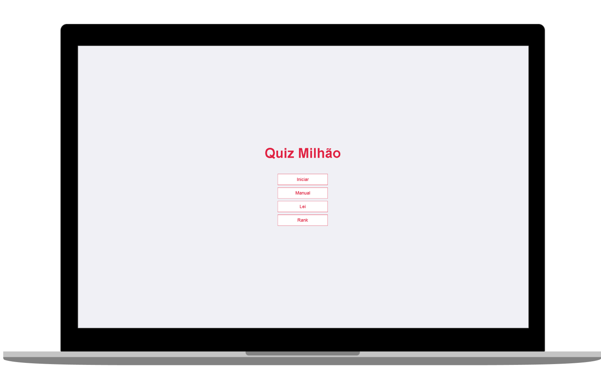

<h1 align="center">
  
</h1>

<h4 align="center">
  🚀 Entrega final projeto da Atividade referente a Lei geral de proteção de dados
</h4>

  <a href="#rocket-tecnologias">Tecnologias</a>&nbsp;&nbsp;&nbsp;|&nbsp;&nbsp;&nbsp;
  <a href="#-projeto">Projeto</a>&nbsp;&nbsp;&nbsp;|&nbsp;&nbsp;&nbsp;
  <a href="#-layout">Layout</a>&nbsp;&nbsp;&nbsp;|&nbsp;&nbsp;&nbsp;
  <a href="#-como-contribuir">Como contribuir</a>&nbsp;&nbsp;&nbsp;|&nbsp;&nbsp;&nbsp;

 

  

## :rocket: Tecnologias

Esse projeto foi desenvolvido com as seguintes tecnologias:

- [PHP](https://www.php.net/)
- [JavaScript]
- [Html]
- [Css]

## 💻 Projeto

O Quiz milhão é um projeto que foi desenvolvido durante a AEP (Atividade Experimental Problematizada) no terceiro semestre do curso Analise e Desenvolvimento de Sistemas, no qual o tema era sobre a nova Lei Geral de Proteção de Dados. O projeto visa conectar pessoas para obter um aprendizado de forma divertida sobre a lei.

## 🤔 Como contribuir

- Faça um fork desse repositório;
- Cria uma branch com a sua feature: `git checkout -b minha-feature`;
- Faça commit das suas alterações: `git commit -m 'feat: Minha nova feature'`;
- Faça push para a sua branch: `git push origin minha-feature`.

Depois que o merge da sua pull request for feito, você pode deletar a sua branch.

